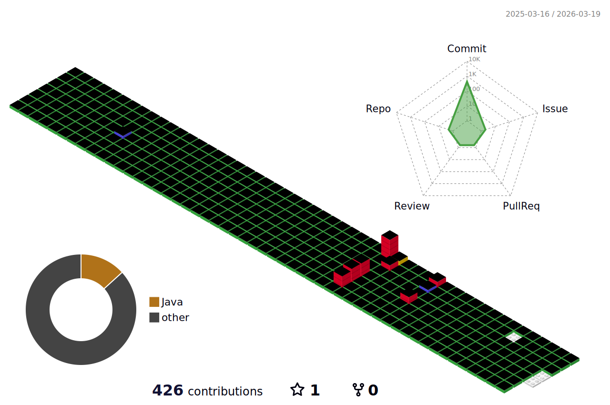

 **_Let's surf!_**

<h1> 🏄‍♂️ SKILL STACKS</h1>

  
   
   
   
  
 
    
   
  
   
  
 
   
  
  
  
  
 
  
  
  
  
  
 

 

<h1> 🐱‍👤 WANNA GET SKILLS </h1>

  
  
  
  
  
 
  
  
  
  
  
 
  
  
  

 
 

<!--
-->
